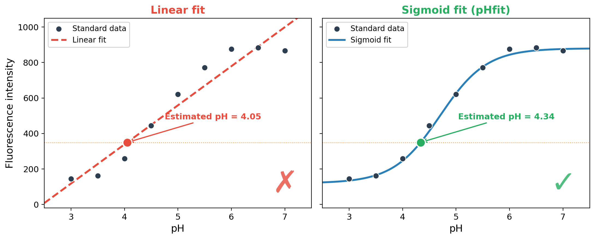

# pHfit

[](https://github.com/NaotoKubota/pHfit/blob/main/LICENSE)
[](https://github.com/NaotoKubota/pHfit/releases)
[](https://github.com/NaotoKubota/pHfit/releases)
[](https://github.com/NaotoKubota/pHfit/actions/workflows/test.yml)
[](https://codecov.io/gh/NaotoKubota/pHfit)
[](https://github.com/NaotoKubota/pHfit/actions/workflows/release.yml)
[](https://github.com/NaotoKubota/pHfit/actions/workflows/publish.yml)
[](https://pypi.org/project/pHfit/)
[](https://pypi.org/project/pHfit/)
[](https://pypi.org/project/pHfit/)
[](https://hub.docker.com/r/naotokubota/pHfit)
[](https://hub.docker.com/r/naotokubota/pHfit)
[](https://hub.docker.com/r/naotokubota/pHfit)

Estimate lysosomal pH from fluorescent indicator data using sigmoid curve fitting.

<p align="center">
  
</p>

The relationship between pH and fluorescence signal (intensity or ratio) of pH-sensitive indicators is inherently **sigmoidal**, governed by the Henderson-Hasselbalch equation. While a linear approximation may appear adequate over a narrow pH range near the pKa, it **systematically misestimates pH** at both ends of the dynamic range — precisely where many biological samples fall. A sigmoid fit faithfully captures the saturation behavior at extreme pH values, yielding accurate estimates across the full range of the indicator.

## Overview

pHfit fits a Henderson-Hasselbalch-derived sigmoid function to standard curve data from fluorescent pH indicator reagents (e.g., LysoSensor, Oregon Green, pHrodo) and estimates sample pH values from the fitted curve.

**Sigmoid function:**

$$F(\text{pH}) = y_{\min} + \frac{y_{\max} - y_{\min}}{1 + 10^{n \cdot (pK_a - \text{pH})}}$$

| Parameter | Description |
|-----------|-------------|
| `y_min` | Minimum signal (fully protonated) |
| `y_max` | Maximum signal (fully deprotonated) |
| `pKa` | Apparent acid dissociation constant (inflection point) |
| `n` | Hill coefficient (positive = ascending, negative = descending) |

pHfit supports both **ascending** indicators (pH↑ → fluorescence↑, e.g., Oregon Green, BCECF) and **descending** indicators (pH↑ → fluorescence↓, e.g., pHrodo, LysoSensor). The direction is auto-detected from the data or inferred from the chosen preset.

## Installation

```bash
pip install pHfit
```

For development:

```bash
git clone https://github.com/NaotoKubota/pHfit.git
cd pHfit
pip install -e ".[dev]"
```

## Usage

### Quick start with example data

Example input files and expected output are included in the [`example/`](example/) directory. Try it out:

```bash
phfit -i example/standard_curve.tsv -s example/sample.tsv -o example/output --preset oregongreen488
```

### Basic usage

```bash
phfit -i standard_curve.tsv -s sample.tsv -o output/
```

### With a reagent preset

```bash
phfit -i standard_curve.tsv -s sample.tsv -o output/ --preset oregongreen488
```

### Descending indicator (e.g., pHrodo)

pHrodo and similar descending indicators produce *higher* signal at *lower* pH. pHfit auto-detects the direction, or you can use a preset:

```bash
# Auto-detection
phfit -i phrodo_standard.tsv -s phrodo_sample.tsv -o output/

# With preset
phfit -i phrodo_standard.tsv -s phrodo_sample.tsv -o output/ --preset phrodo_red
```

A pHrodo example is included in the repository:

```bash
phfit -i example/phrodo_standard_curve.tsv -s example/phrodo_sample.tsv -o example/phrodo_output
```

### Standard curve fitting only (no samples)

```bash
phfit -i standard_curve.tsv -o output/
```

### List available presets

You can check all available presets and their directions with:

```bash
phfit --preset list
```

### Estimate Hill coefficient from data

```bash
phfit -i standard_curve.tsv -s sample.tsv -o output/ --hill fit
```

## Input File Format

### standard_curve.tsv

Tab-separated file with columns `pH` and `value`. Replicates (rows with the same pH) are automatically averaged.

The `value` column accepts any scalar fluorescence readout — single-wavelength intensity, fluorescence ratio, or any other derived metric. The same sigmoid model applies to all cases.

```
pH	value
3.0	105.2
3.0	110.8
3.0	98.5
4.0	150.3
4.0	145.7
4.0	155.1
5.0	450.2
5.0	448.9
5.0	455.3
6.0	720.1
6.0	715.8
6.0	725.4
7.0	790.5
7.0	785.2
7.0	792.8
```

### sample.tsv

Tab-separated file with columns `sample` and `value`. Replicates (rows with the same sample name) are automatically averaged.

```
sample	value
sampleA	250.3
sampleA	245.7
sampleA	255.1
sampleB	520.4
sampleB	518.9
sampleB	525.3
```

### Creating TSV files from Excel

If you are not familiar with TSV files, you can easily create them from Microsoft Excel or Google Sheets:

1. Open Excel (or Google Sheets) and enter your data with the column headers (`pH` and `value`, or `sample` and `value`) in the first row.
2. **Excel:** Go to **File → Save As**, choose **Text (Tab delimited) (\*.txt)** as the file format, and save. Then rename the file extension from `.txt` to `.tsv`.
3. **Google Sheets:** Go to **File → Download → Tab-separated values (.tsv)**.

> [!Note]
>  Make sure the first row contains exactly the column headers `pH` and `value` (for the standard curve) or `sample` and `value` (for sample data). Do not include extra blank rows or columns.

## Output Files

| File | Description |
|------|-------------|
| `fit_params.tsv` | Fitted parameters (y_min, y_max, pKa, n, R²) |
| `standard_curve.pdf` | Standard curve plot (PDF) |
| `standard_curve.png` | Standard curve plot (PNG) |
| `estimated_pH.tsv` | Estimated pH for each sample (averaged) |
| `estimated_pH_all.tsv` | Estimated pH for each individual replicate |
| `sample_estimates.pdf` | Sample estimates plot (PDF) |
| `sample_estimates.png` | Sample estimates plot (PNG) |
| `report.html` | Self-contained HTML report with interactive plots |

### Interactive HTML Report

`report.html` is a self-contained, single-file HTML report that can be opened in any web browser. It includes:

- **Fitted parameters** — y_min, y_max, pKa, n (Hill coefficient), R², and sigmoid direction
- **Interactive standard curve** — Plotly-powered chart with hover tooltips showing exact pH and signal values; zoom, pan, and export are built-in
- **Sample pH estimates** — Interactive chart mapping each sample's fluorescence to estimated pH on the fitted curve (when `-s` is provided)
- **Sigmoid equation** — The fitted model equation displayed in the report header

No internet connection is required after generating the report — all Plotly assets are loaded via CDN at generation time and the chart data is embedded inline.

See an example report: [example/output/report.html](https://raw.githack.com/NaotoKubota/pHfit/main/example/output/report.html)

## CLI Options

| Option | Description |
|--------|-------------|
| `-i`, `--input` | Path to standard curve TSV (required) |
| `-s`, `--sample` | Path to sample TSV (optional) |
| `-o`, `--output` | Output directory (required) |
| `--preset` | Reagent preset name or `list` |
| `--pka` | Fix pKa value |
| `--ymin` | Fix y_min value |
| `--ymax` | Fix y_max value |
| `--hill` | Hill coefficient: number to fix, or `fit` to estimate |
| `--dpi` | PNG resolution (default: 300) |
| `--verbose` | Enable verbose (DEBUG-level) logging output |

## Available Presets

| Preset name | Reagent | pKa | Direction |
|-------------|---------|-----|-----------|
| `oregongreen488` | Oregon Green 488 | 4.7 | ↑ ascending |
| `oregongreen514` | Oregon Green 514 | 4.8 | ↑ ascending |
| `phrodo_red` | pHrodo Red | 6.5 | ↓ descending |
| `phrodo_green` | pHrodo Green | 6.5 | ↓ descending |
| `lysosensor_green` | LysoSensor Green DND-189 | 5.2 | ↓ descending |
| `lysosensor_blue` | LysoSensor Blue DND-167 | 5.1 | ↓ descending |
| `lysosensor_yellowblue` | LysoSensor Yellow/Blue DND-160 | 4.2 | ↓ descending |
| `bcecf` | BCECF | 6.98 | ↑ ascending |
| `fitc` | FITC / Fluorescein | 6.4 | ↑ ascending |
| `snarf1` | SNARF-1 | 7.5 | ↑ ascending |
| `cypher5e` | CypHer5E | 7.3 | ↓ descending |
| `hpts` | HPTS (Pyranine) | 7.3 | ↑ ascending |

## Note on Ratiometric Indicators

Some pH indicators (e.g., BCECF, SNARF-1, HPTS, LysoSensor Yellow/Blue) are measured ratiometrically — the ratio of fluorescence at two excitation or emission wavelengths is used instead of a single intensity value. The Henderson-Hasselbalch sigmoid model applies equally to ratio data; users simply provide the pre-computed fluorescence ratio in the `value` column of the input TSV.

> [!Tip]
> For ratiometric indicators, the preset pKa represents a *typical* apparent pKa that may vary depending on your optical setup (filter sets, detector gains, etc.). Consider omitting `--pka` or using `--hill fit` to let pHfit estimate all parameters freely from your calibration data.

## License

MIT License

## Contributing

Thank you for wanting to improve pHfit! If you have any bugs or questions, feel free to [open an issue](https://github.com/NaotoKubota/pHfit/issues) or pull request.

## Authors

- Naoto Kubota ([0000-0003-0612-2300](https://orcid.org/0000-0003-0612-2300))
- Sika Zheng ([0000-0002-0573-4981](https://orcid.org/0000-0002-0573-4981))
